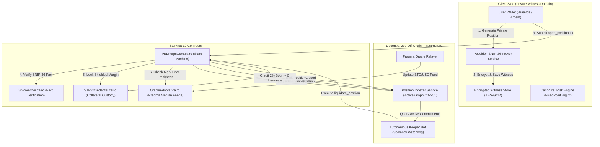

# PEL Private Perpetuals — Architecture & State Machine Specification

**Protocol:** Private Execution Layer (PEL) BTC-PERP  
**Version:** 2.0 (V3 Master Spec)  
**Standard:** Poseidon SNIP-36 Fact Commitment State Machine  

---

## 1. System Architecture Overview

---

## 2. Privacy Boundary Matrix

| Data Field | Storage Location | Visibility | Cryptographic Binding |
| :--- | :--- | :--- | :--- |
| **Position Side** (`LONG` / `SHORT`) | Client Witness | **PRIVATE** | Poseidon Hash bound in $C_t$ |
| **Quantity** ($q$ satoshis) | Client Witness | **PRIVATE** | Bound in $C_t$ and fact hash $\Phi$ |
| **Entry Price** ($P_{\text{entry}}$ cents) | Client Witness | **PRIVATE** | Bound in $C_t$ and fact hash $\Phi$ |
| **Owner Secret Key** ($sk$) | Client Encrypted Storage | **PRIVATE** | Proves ownership without leakage |
| **Commitment** ($C_t$) | Starknet Contract (`positions`) | **PUBLIC** | $C_t = \text{Poseidon}(\text{DOMAIN}, \text{side}, q, P_e, M, \text{nonce}, sk)$ |
| **Nullifier** ($N_t$) | Starknet Contract (`used_nullifiers`) | **PUBLIC** | $N_t = \text{Poseidon}(\text{NULLIFIER\_TAG}, sk, \text{nonce})$ |
| **Locked Collateral** ($M$) | `STRK20Adapter` | **PUBLIC (AGGREGATED)** | Total pool collateral is public; individual breakdown is private. |
| **Mark Price** ($P_{\text{mark}}$) | `OracleAdapter` | **PUBLIC** | Authenticated Pragma on-chain feed |

---

## 3. State Transition Rules

### 1. `OPEN_POSITION`
$$\begin{aligned}
\text{Inputs:} &\quad \text{market\_id}, C_0, N_0, M, \Phi_{\text{open}} \\
\text{Preconditions:} &\quad \text{IsUnspent}(N_0) \land M \ge M_{\text{min}} \land \text{VerifyFact}(\Phi_{\text{open}}) \\
\text{State Change:} &\quad \text{positions}[C_0] \leftarrow \text{Active}, \quad \text{used\_nullifiers}[N_0] \leftarrow \text{true}, \quad \text{total\_locked} += M \\
\text{Emits:} &\quad \text{PositionOpened}(\text{market\_id}, C_0, N_0, M)
\end{aligned}$$

### 2. `UPDATE_POSITION` (Modify Size / Margin)
$$\begin{aligned}
\text{Inputs:} &\quad \text{market\_id}, C_t, N_t, C_{t+1}, \Phi_{\text{update}} \\
\text{Preconditions:} &\quad \text{positions}[C_t] = \text{Active} \land \text{IsUnspent}(N_t) \land \text{VerifyFact}(\Phi_{\text{update}}) \\
\text{State Change:} &\quad \text{positions}[C_t] \leftarrow \text{Superseded}, \quad \text{positions}[C_{t+1}] \leftarrow \text{Active}, \quad \text{used\_nullifiers}[N_t] \leftarrow \text{true} \\
\text{Emits:} &\quad \text{PositionUpdated}(\text{market\_id}, C_t, N_t, C_{t+1})
\end{aligned}$$

### 3. `FUND_POSITION` (Continuous Periodic Funding Accrual)
$$\begin{aligned}
\text{Inputs:} &\quad \text{market\_id}, C_t, N_t, C_{t+1}, \Delta F, \text{is\_long\_pays}, \Phi_{\text{fund}} \\
\text{Preconditions:} &\quad \text{positions}[C_t] = \text{Active} \land \text{IsUnspent}(N_t) \land \text{VerifyFact}(\Phi_{\text{fund}}) \\
\text{State Change:} &\quad \text{positions}[C_t] \leftarrow \text{Superseded}, \quad \text{positions}[C_{t+1}] \leftarrow \text{Active}, \quad \text{insurance\_fund} += \Delta F \\
\text{Emits:} &\quad \text{PositionFunded}(\text{market\_id}, C_t, N_t, C_{t+1}, \Delta F, \text{is\_long\_pays})
\end{aligned}$$

### 4. `CLOSE_POSITION` (Full Settlement)
$$\begin{aligned}
\text{Inputs:} &\quad \text{market\_id}, C_t, N_{\text{final}}, C_{\text{payout}}, \text{PayoutAmount}, \Phi_{\text{close}} \\
\text{Preconditions:} &\quad \text{positions}[C_t] = \text{Active} \land \text{IsUnspent}(N_{\text{final}}) \land \text{VerifyFact}(\Phi_{\text{close}}) \\
\text{State Change:} &\quad \text{positions}[C_t] \leftarrow \text{Closed}, \quad \text{registered\_notes}[C_{\text{payout}}] \leftarrow \text{PayoutAmount} \\
\text{Emits:} &\quad \text{PositionClosed}(\text{market\_id}, C_t, N_{\text{final}}, \text{PayoutAmount})
\end{aligned}$$

### 5. `LIQUIDATE_POSITION` (Insolvency Protection)
$$\begin{aligned}
\text{Inputs:} &\quad \text{market\_id}, C_t, N_t, \Phi_{\text{liq}}, \text{keeper\_recipient} \\
\text{Preconditions:} &\quad \text{positions}[C_t] = \text{Active} \land \text{IsUnspent}(N_t) \land \text{VerifyFact}(\Phi_{\text{liq}}) \\
\text{Collateral Split:} &\quad \text{Bounty} = M \times 2\%, \quad \text{InsuranceCredit} = M \times 98\% \\
\text{State Change:} &\quad \text{positions}[C_t] \leftarrow \text{Liquidated}, \quad \text{keeper\_bounties}[\text{keeper}] += \text{Bounty}, \quad \text{insurance\_fund} += \text{InsuranceCredit} \\
\text{Emits:} &\quad \text{PositionLiquidated}(\text{market\_id}, C_t, N_t, \text{keeper})
\end{aligned}$$
