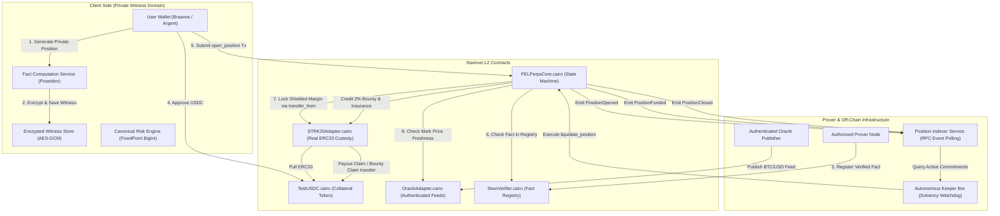

# PEL Private Perpetuals — Architecture & State Machine Specification

**Protocol:** Private Execution Layer (PEL) BTC-PERP  
**Version:** 2.1 (V4 Enforcement Layer Rebuild)  
**Standard:** Fact Registry & Real ERC20 Custody State Machine  

---

## 1. System Architecture Overview

---

## 2. Privacy Boundary Matrix

| Data Field | Storage Location | Visibility | Cryptographic Binding |
| :--- | :--- | :--- | :--- |
| **Position Side** (`LONG` / `SHORT`) | Client Witness | **PRIVATE** | Poseidon Hash bound in $C_t$ |
| **Quantity** ($q$ satoshis) | Client Witness | **PRIVATE** | Bound in $C_t$ and fact hash $\Phi$ |
| **Entry Price** ($P_{\text{entry}}$ cents) | Client Witness | **PRIVATE** | Bound in $C_t$ and fact hash $\Phi$ |
| **Owner Secret Key** ($sk$) | Client Encrypted Storage | **PRIVATE** | Proves ownership without leakage |
| **Commitment** ($C_t$) | Starknet Contract (`positions`) | **PUBLIC** | $C_t = \text{Poseidon}(\text{DOMAIN}, \text{side}, q, P_e, M, \text{nonce}, sk)$ |
| **Nullifier** ($N_t$) | Starknet Contract (`used_nullifiers`) | **PUBLIC** | $N_t = \text{Poseidon}(\text{NULLIFIER\_TAG}, sk, C_t)$ |
| **Locked Margin** ($M$) | Starknet Contract (`positions`) | **PUBLIC (Isolated)** | Required for solvency checks & liquidation |
| **Market ID** (`BTC-PERP`) | Starknet Contract (`positions`) | **PUBLIC** | Enforces market isolation |

---

## 3. Formal State Transitions

### State 1: `OPEN`
$$\sigma_0 \xrightarrow{\text{open\_position}(C_0, N_{\text{margin}}, M, \Phi_{\text{open}})} \sigma_1$$
- **Preconditions:**
  1. $N_{\text{margin}} \notin \text{used\_nullifiers}$
  2. $C_0 \notin \text{positions}$
  3. $\text{FactRegistry}[\Phi_{\text{open}}] == \text{true}$
  4. $\text{OraclePrice}.\text{is\_valid} == \text{true}$
- **Effects:**
  1. $\text{used\_nullifiers}[N_{\text{margin}}] \leftarrow \text{true}$
  2. $\text{positions}[C_0] \leftarrow \text{PositionRecord}(C_0, N_{\text{margin}}, M, \text{active})$
  3. Real ERC20 pulled via $\text{IERC20.transfer\_from}(\text{caller}, \text{adapter}, M)$

### State 2: `CLOSE`
$$\sigma_t \xrightarrow{\text{close\_position}(C_t, N_t, C_{\text{payout}}, \text{Payout}, \Phi_{\text{close}})} \sigma_{t+1}$$
- **Preconditions:**
  1. $\text{positions}[C_t].\text{is\_active} == \text{true}$
  2. $N_t \notin \text{used\_nullifiers}$
  3. $\text{FactRegistry}[\Phi_{\text{close}}] == \text{true}$
  4. $\text{Payout} \le \text{positions}[C_t].\text{locked\_margin}$
- **Effects:**
  1. $\text{positions}[C_t].\text{is\_active} \leftarrow \text{false}$
  2. $\text{used\_nullifiers}[N_t] \leftarrow \text{true}$
  3. $\text{registered\_notes}[C_{\text{payout}}] \leftarrow \text{Payout}$
  4. Remaining margin $(M - \text{Payout}) \to \text{insurance\_fund}$
  5. User can call $\text{claim\_payout}(C_{\text{payout}}, \text{recipient})$ to receive real ERC20 tokens
